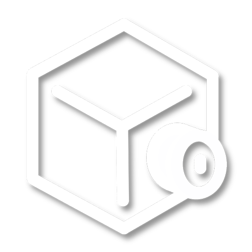

<h3>An Open-Source Interactive Film Engine that lets you create Interactive Films with ease.</h3>
 

<h4>This project is still in-progress. It may not work in its current state.</h4>

## Getting Started

#### Linux/Unix (NOT OSX)

*Note: Unix based platforms other than Mac OSX have not been tested. Hexwave may not work on those platforms.*

Download the git repo (via `git clone` or downloading as a zip) and put it somewhere! From there, run `cmake -B build` in the folder and then `cmake --build build -j4`.****

#### Mac OSX

Sadly, in the current state of Hexwave, OSX is not supported as Hexwave uses older versions of OpenGL that do not work on OSX.

This is subject to change.

#### Windows

*Note: Whilst MinGW may be supported by the other libraries used, we do not directly support it and will not offer support for it. If it works for you, great! However, we will not be directly supporting that as it has far too many issues. You should either use MSVC or clang-cl.*

Coming soon...

## Dependencies

- `cmake` (version 3.25 or higher)
- `ffmpeg` (version 5 or higher)
- `imgui` (will auto download upon `cmake -B build`)
- `glfw` (will auto download upon `cmake -B build`)
- `glad` (will auto download upon `cmake -B build`)
- `glm` (will auto download upon `cmake -B build`)
- OpenGL 4.1+

### Linux Only:

- `libavcodec-dev`
- `libavformat-dev`
- `libswscale-dev`
- `xorg-dev`